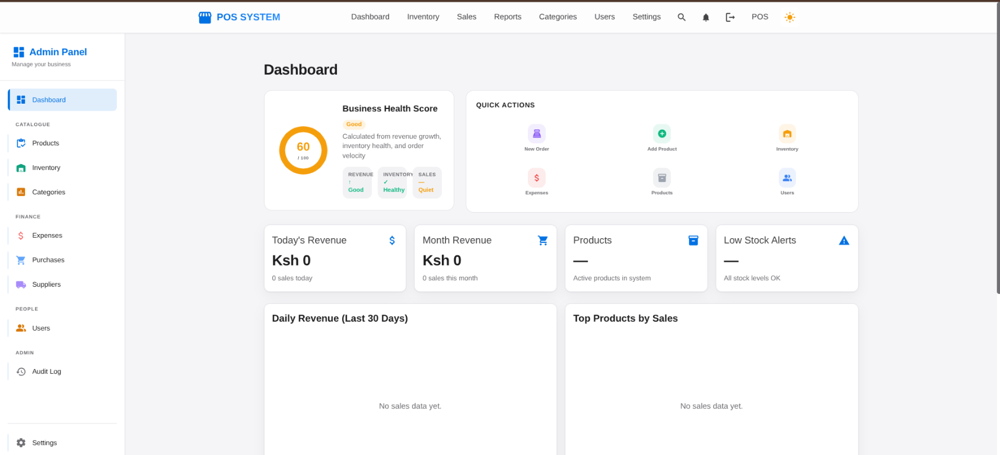
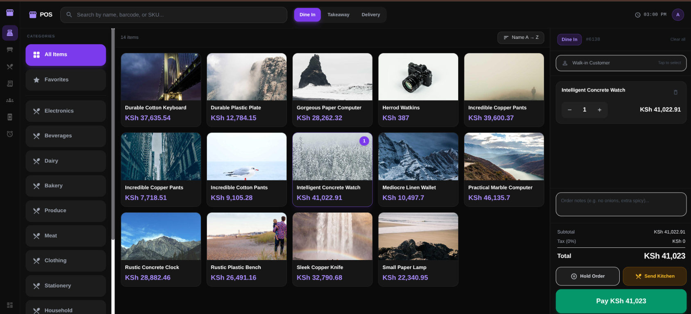
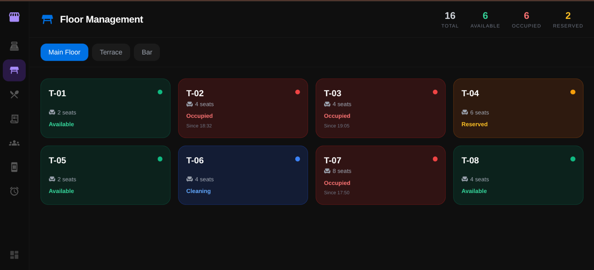
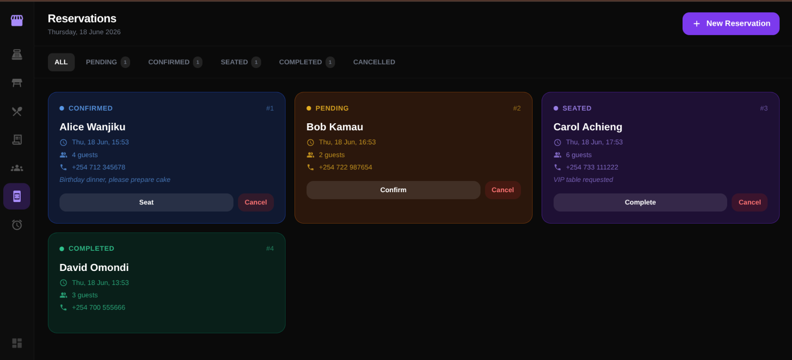
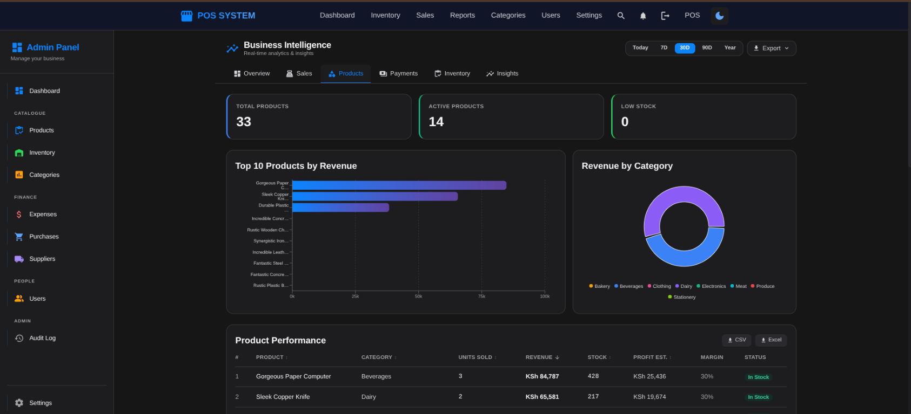
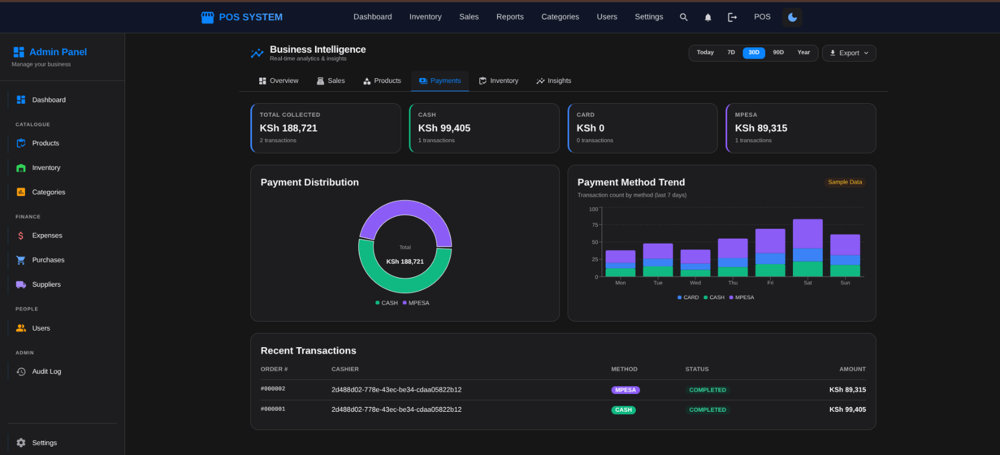
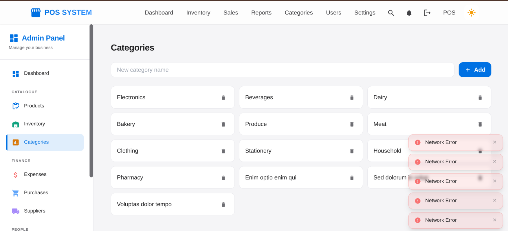

<div align="center">


# 🛒 Restaurant & Retail POS Platform

**A premium, full-stack Point of Sale system built for restaurants and retail businesses.**  
Touchscreen-optimized. Business-intelligence ready. Production-grade from day one.

[✨ Features](#-features) • [📸 Screenshots](#-screenshots) • [🚀 Quick Start](#-quick-start) • [🏗️ Architecture](#️-architecture) • [💛 Support & Sponsorship](#-support--sponsorship)

---

</div>

## ✨ Features

This is not a simple POS screen — it is a **complete business operating platform** for restaurants and retail stores, comparable to Toast POS, Square POS, and Lightspeed Restaurant.

### 🖥️ Dual-Mode Interface
| Mode | Description |
|------|-------------|
| **POS Mode** (`/pos/*`) | Dark, fullscreen, touchscreen-optimized cashier terminal |
| **Admin Mode** (`/admin/*`) | Light/dark management dashboard with full business control |

### 💼 Core POS Operations
- **Touchscreen Checkout** — tap-to-add products, barcode/SKU search, sort by name, price, or date modified
- **Floor Management** — real-time table status (Available / Occupied / Reserved / Cleaning) across multiple floors
- **Kitchen Display** — live order queue with preparation timers and status updates
- **Order Management** — hold orders, send to kitchen, split bills, mixed payments
- **Reservation Booking** — full reservation workflow (Pending → Confirmed → Seated → Completed)
- **Shift Management** — open/close shifts with cash reconciliation

### 📊 Business Intelligence
- **Executive Dashboard** — Business Health Score, KPI cards, quick actions, activity feed
- **Sales Analytics** — daily, weekly, monthly, and yearly revenue with trend charts
- **Product Analytics** — top sellers, revenue by category, profit margins
- **Payments Analytics** — Cash, Card, and M-Pesa breakdown with method trends
- **Inventory Intelligence** — low-stock alerts, reorder recommendations, stock history

### 🏪 Administration
- **Product Catalog** — full CRUD with image upload and compression
- **Category Management** — organize your menu or product catalog
- **Expense Tracking** — rent, utilities, salaries, and more
- **Purchase Orders** — supplier management, draft → sent → received workflow
- **User Management** — role-based access control (Admin, Manager, Cashier, Stock Clerk)
- **Audit Log** — immutable record of every critical action
- **Finance Module** — expenses, purchases, and supplier management under `/finance/*`

### 🔐 Security & Authentication
- Keycloak OAuth2 / PKCE / JWT — industry-standard authentication
- Role-based route protection
- Per-action permission matrix

### 💳 Payment Support
- Cash (with change calculation)
- Card
- M-Pesa
- Mixed / Split payments

---

## 📸 Screenshots

### Command Center Dashboard

*Business Health Score, KPI cards, quick actions, and revenue charts — all at a glance.*

---

### Touchscreen POS Checkout

*Fullscreen cashier terminal: category sidebar, sortable product grid, and live order panel.*

---

### Floor Management

*Real-time table status across multiple floors — Available, Occupied, Reserved, and Cleaning.*

---

### Reservation Management

*Full reservation workflow from booking to completion with guest notes and status tracking.*

---

### Business Intelligence — Product Analytics

*Top products by revenue, revenue by category, and detailed product performance table.*

---

### Business Intelligence — Payment Analytics

*Cash, Card, and M-Pesa breakdown with distribution chart and payment method trend.*

---

### Category Management

*Clean category management with instant add functionality.*

---

## 🏗️ Architecture

```
Point_of_Sale_System/
├── posFrontend/          ← React 19 + Vite 7 + Tailwind CSS
│   ├── src/
│   │   ├── pos/          ← POS Mode (dark, fullscreen terminal)
│   │   │   ├── checkout/ ← Touchscreen checkout
│   │   │   ├── tables/   ← Floor management
│   │   │   ├── kitchen/  ← Kitchen display
│   │   │   ├── orders/   ← Order history
│   │   │   ├── customers/← Customer lookup
│   │   │   ├── shift/    ← Shift management
│   │   │   └── reservations/ ← Reservation booking
│   │   ├── admin/        ← Admin Mode (management dashboard)
│   │   ├── pages/        ← Dashboard, Products, Reports, Finance
│   │   ├── components/   ← GlobalSearch, NotificationBell, Charts
│   │   └── services/     ← Axios API layer
│   └── package.json
│
└── posBackend/           ← Spring Boot 3.5 REST API
    ├── src/main/java/com/pos/
    │   ├── controller/   ← REST controllers
    │   ├── service/      ← Business logic
    │   ├── model/        ← JPA entities
    │   ├── repository/   ← Spring Data repositories
    │   └── dto/          ← Request / response DTOs
    └── pom.xml
```

### Tech Stack

| Layer | Technology |
|-------|-----------|
| **Frontend** | React 19, Vite 7, Tailwind CSS 3, MUI Icons, Recharts, React Query |
| **Backend** | Spring Boot 3.5, Spring Data JPA, Spring Security, Hibernate 6 |
| **Authentication** | Keycloak (OAuth2 / PKCE / JWT) |
| **Database** | PostgreSQL 15 |
| **File Storage** | MinIO (S3-compatible) |
| **API Docs** | Swagger UI / OpenAPI 3 |

---

## 🚀 Quick Start

### Prerequisites

Ensure you have **Docker**, **Java 21**, **Node.js 20+**, and **Maven** installed.

### Step 1 — Start Infrastructure

```bash
# PostgreSQL database
docker run --name pos-db \
  -e POSTGRES_USER=pos_user \
  -e POSTGRES_PASSWORD=pos_pass \
  -e POSTGRES_DB=pos_db \
  -p 5432:5432 -d postgres:15

# MinIO (image storage)
docker run --name pos-minio \
  -e MINIO_ROOT_USER=minioadmin \
  -e MINIO_ROOT_PASSWORD=minioadmin \
  -p 9000:9000 -p 9001:9001 \
  -d minio/minio server /data --console-address ":9001"

# Keycloak (authentication)
docker run --name pos-keycloak \
  -e KEYCLOAK_ADMIN=admin \
  -e KEYCLOAK_ADMIN_PASSWORD=admin \
  -p 8081:8080 -d quay.io/keycloak/keycloak:24.0 start-dev
```

> **Keycloak setup**: Create realm `pos`, client `pos-client` (Public, PKCE enabled), and realm roles: `admin`, `manager`, `cashier`, `clerk`.

### Step 2 — Run the Backend

```bash
cd posBackend
./mvnw spring-boot:run
```

| Service | URL |
|---------|-----|
| API Base | `http://localhost:8080` |
| Swagger UI | `http://localhost:8080/swagger-ui/index.html` |

**Backend environment variables** (all have safe development defaults):

| Variable | Default | Description |
|----------|---------|-------------|
| `DB_URL` | `jdbc:postgresql://localhost:5432/pos_db` | Database URL |
| `DB_USERNAME` | `pos_user` | Database user |
| `DB_PASSWORD` | `pos_pass` | Database password |
| `KEYCLOAK_URL` | `http://localhost:8081` | Keycloak base URL |
| `KEYCLOAK_REALM` | `pos` | Keycloak realm |
| `MINIO_ENDPOINT` | `http://localhost:9000` | MinIO endpoint |
| `MINIO_ACCESS_KEY` | `minioadmin` | MinIO access key |
| `MINIO_SECRET_KEY` | `minioadmin` | MinIO secret key |
| `MINIO_BUCKET` | `product-images` | MinIO bucket |
| `CORS_ALLOWED_ORIGINS` | `http://localhost:5173` | Allowed frontend origins |
| `POS_TAX_RATE` | `0` | Tax rate % (e.g. `16` for 16% VAT) |

### Step 3 — Run the Frontend

```bash
cd posFrontend
npm install
npm run dev
```

Create a `.env.local` file with:

```env
VITE_KEYCLOAK_URL=http://localhost:8081
VITE_KEYCLOAK_REALM=pos
VITE_KEYCLOAK_CLIENT_ID=pos-client
VITE_API_BASE_URL=http://localhost:8080
VITE_REDIRECT_URI=http://localhost:5173
```

| Service | URL |
|---------|-----|
| Frontend App | `http://localhost:5173` |
| Admin Dashboard | `http://localhost:5173/admin/dashboard` |
| POS Checkout | `http://localhost:5173/pos/checkout` |

---

## 🔑 Roles & Permissions

| Role | Access Level |
|------|-------------|
| `admin` | Full access — users, products, reports, settings, audit log |
| `manager` | All except user management |
| `cashier` | POS checkout, orders, tables, customers, shift |
| `clerk` | Inventory and stock adjustments only |

---

## 📡 Key API Endpoints

### Sales
| Method | Endpoint | Description |
|--------|----------|-------------|
| `POST` | `/api/sale` | Create a sale |
| `GET` | `/api/sale` | List all sales (paginated) |
| `GET` | `/api/sale/{id}/receipt` | Get plain-text receipt |
| `POST` | `/api/sale/{id}/return` | Process a return |

### Products
| Method | Endpoint | Description |
|--------|----------|-------------|
| `POST` | `/api/product/create` | Create product with image |
| `GET` | `/api/product` | List all products |
| `PUT` | `/api/product/{id}` | Update product |
| `DELETE` | `/api/product/{id}` | Delete product |
| `POST` | `/api/product/{id}/stock-adjustment` | Adjust stock level |
| `GET` | `/api/product/low-stock` | Get low-stock products |

### Reports
| Method | Endpoint | Description |
|--------|----------|-------------|
| `GET` | `/api/report/summary` | Full dashboard KPIs and chart data |
| `GET` | `/api/report/low-stock` | Low stock alert list |

---

## 🗺️ Roadmap

- [ ] Flyway database migrations
- [ ] Redis cache for distributed deployments
- [ ] Mobile PWA for cashiers
- [ ] Customer loyalty points & rewards
- [ ] Automated scheduled report emails
- [ ] Multi-branch / multi-location support
- [ ] Unit and integration test suite

---

## 💛 Support & Sponsorship

This project is **free and open source**. If you find it useful for your business or development, please consider supporting its continued development.

### ⭐ Star the Repository

The simplest way to show your support is to **star this repository** on GitHub. It helps others discover the project and motivates continued development.

👉 [Give it a star ⭐](https://github.com/MichaelNgogoyo/Point_of_Sale_System)

---

### 💬 Share & Recommend

- Share this project with other developers and restaurant owners
- Recommend it in developer communities, Discord servers, and forums
- Write a blog post or tweet about your experience

---

### 🐛 Contribute

Contributions are welcome and appreciated:

1. Fork the repository
2. Create a feature branch: `git checkout -b feature/your-feature`
3. Commit your changes: `git commit -m "feat: add your feature"`
4. Push to your branch: `git push origin feature/your-feature`
5. Open a Pull Request

Please open an issue first for major changes so we can discuss the approach.

---

### 💰 Sponsor

If this project saves you time, helps your business, or you would like to sponsor active development of new features, you can support via:

| Platform | Link |
|----------|------|
| ☕ Buy Me a Coffee | [buymeacoffee.com/michaelngogoyo](https://buymeacoffee.com/michaelngogoyo) |
| 💳 M-Pesa (Kenya) | **0793 XXX XXX** — Paybill/Till on request |

Sponsors get:
- Priority feature requests
- Direct support via email
- Recognition in the project changelog

---

## 📜 License

This project is licensed under the **MIT License** — free to use, modify, and distribute.

---

<div align="center">

Built with ❤️ for restaurants and retailers across Kenya and beyond.

**[⭐ Star on GitHub](https://github.com/MichaelNgogoyo/Point_of_Sale_System)** • **[🐛 Report a Bug](https://github.com/MichaelNgogoyo/Point_of_Sale_System/issues)** • **[💡 Request a Feature](https://github.com/MichaelNgogoyo/Point_of_Sale_System/issues)**

</div>
